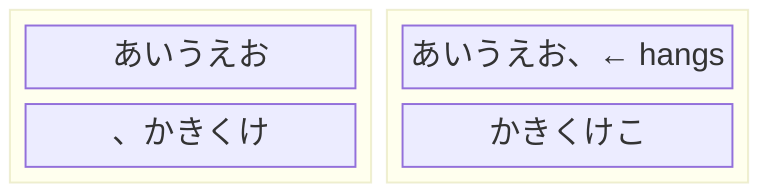

# mejiro

Japanese vertical text layout engine for the web. Handles line breaking, kinsoku shori (禁則処理), hanging punctuation, ruby (furigana) preprocessing, and pagination — all with zero DOM dependencies in the core.

<p align="center">
  
</p>

```bash
npm install @libraz/mejiro
yarn add @libraz/mejiro
pnpm add @libraz/mejiro
bun add @libraz/mejiro
```

## Overview

mejiro provides the building blocks for rendering Japanese vertical text (`writing-mode: vertical-rl`) in the browser. The core engine operates on typed arrays and pure math, making it fast, deterministic, and portable. Browser-specific concerns (font measurement, Canvas API) live in a separate subpath, and EPUB parsing is available as a third.

```
@libraz/mejiro          Core: line breaking, kinsoku, hanging, ruby, pagination
@libraz/mejiro/browser  Browser: font measurement, width caching, layout integration
@libraz/mejiro/epub     EPUB: parsing, ruby extraction
@libraz/mejiro/render   Render: layout data → framework-agnostic page structure + CSS
```

## Architecture

```
Application (React / Vue / vanilla DOM)
       ↓
  @libraz/mejiro/render   Layout data → RenderPage structure + CSS
       ↓
  @libraz/mejiro/epub     EPUB → text + ruby annotations
       ↓
  @libraz/mejiro/browser  Font measurement + ruby font derivation
       ↓
  @libraz/mejiro          Line breaking + kinsoku + hanging + ruby + pagination
```

- **Core** has zero external dependencies
- **Browser** uses Canvas and FontFace APIs
- **EPUB** depends on `jszip`
- **Render** converts layout results into a framework-agnostic `RenderPage` data structure

## Quick Start

```ts
import { MejiroBrowser, verticalLineWidth } from '@libraz/mejiro/browser';
import { getLineRanges, paginate } from '@libraz/mejiro';

const mejiro = new MejiroBrowser();

// 1. Lay out text
const result = await mejiro.layout({
  text: '吾輩は猫である。名前はまだ無い。',
  fontFamily: '"Noto Serif JP"',
  fontSize: 16,
  lineWidth: verticalLineWidth(600, 16), // container height, font size
});

// 2. Get line ranges
const lines = getLineRanges(result.breakPoints, 16); // [[0, 8], [8, 16]]

// 3. Paginate
const pages = paginate(400, [
  { lineCount: lines.length, linePitch: 16 * 1.8, gapBefore: 0 },
]);
```

### EPUB + Chapter Layout + Render

```ts
import { parseEpub } from '@libraz/mejiro/epub';
import { MejiroBrowser, verticalLineWidth } from '@libraz/mejiro/browser';
import { paginate } from '@libraz/mejiro';
import { buildParagraphMeasures, buildRenderPage } from '@libraz/mejiro/render';
import type { RenderEntry } from '@libraz/mejiro/render';
import '@libraz/mejiro/render/mejiro.css';

const mejiro = new MejiroBrowser();
const book = await parseEpub(epubArrayBuffer);
const chapter = book.chapters[0];

// 1. Lay out all paragraphs
const result = await mejiro.layoutChapter({
  paragraphs: chapter.paragraphs.map((p) => ({
    text: p.text,
    rubyAnnotations: p.rubyAnnotations,
  })),
  fontFamily: '"Noto Serif JP"',
  fontSize: 16,
  lineWidth: verticalLineWidth(600, 16),
});

// 2. Build render entries
const entries: RenderEntry[] = chapter.paragraphs.map((p, i) => ({
  chars: result.paragraphs[i].chars,
  breakPoints: result.paragraphs[i].breakResult.breakPoints,
  rubyAnnotations: p.rubyAnnotations,
  isHeading: !!p.headingLevel,
}));

// 3. Paginate
const measures = buildParagraphMeasures(entries, { fontSize: 16, lineHeight: 1.8 });
const pages = paginate(400, measures);

// 4. Render a page (framework-agnostic data)
const renderPage = buildRenderPage(pages[0], entries);
// renderPage.paragraphs → lines → segments (text or ruby)
```

## API Reference

### `@libraz/mejiro` — Core

#### Line Breaking

| Export | Description |
|---|---|
| `computeBreaks(input: LayoutInput): BreakResult` | Computes line break positions. Greedy O(n) algorithm with kinsoku backtracking and optional hanging punctuation. |
| `canBreakAt(text, pos, clusterIds?, mode?): boolean` | Tests whether a line break is allowed after the given position. |

#### Kinsoku (Line Break Prohibition)

| Export | Description |
|---|---|
| `isLineStartProhibited(cp, mode?): boolean` | Tests if a codepoint is prohibited at the start of a line. |
| `isLineEndProhibited(cp): boolean` | Tests if a codepoint is prohibited at the end of a line. |
| `getDefaultKinsokuRules(): KinsokuRules` | Returns the default kinsoku rule set. |
| `setKinsokuRules(rules): void` | Replaces the active kinsoku rules globally. |

#### Hanging Punctuation

| Export | Description |
|---|---|
| `isHangingTarget(cp): boolean` | Tests if a codepoint is eligible for hanging (e.g. `。` `、`). |
| `computeHangingAdjustment(cp, advance): number` | Computes the hanging protrusion amount for a punctuation character. |

#### Ruby (Furigana) Preprocessing

| Export | Description |
|---|---|
| `preprocessRuby(text, advances, annotations, clusterIds?): { effectiveAdvances, clusterIds }` | Distributes ruby text widths across base characters and generates cluster IDs. |
| `isKana(cp): boolean` | Tests if a codepoint is hiragana or katakana. |

#### Cluster Support

| Export | Description |
|---|---|
| `resolveClusterBoundaries(clusterIds): Uint32Array` | Normalizes cluster IDs to sequential boundaries. |
| `isClusterBreakAllowed(clusterIds, pos, len): boolean` | Tests if a break is allowed at the given position respecting cluster boundaries. |

#### Pagination

| Export | Description |
|---|---|
| `paginate(pageBlockSize, paragraphs): PageSlice[][]` | Distributes paragraph lines across fixed-size pages, splitting at page boundaries. |
| `getLineRanges(breakPoints, charCount): [number, number][]` | Converts break points into `[start, end)` character index pairs per line. |

#### Types

| Type | Description |
|---|---|
| `LayoutInput` | Input parameters: text (`Uint32Array`), advances (`Float32Array`), lineWidth, mode, etc. |
| `BreakResult` | Output: breakPoints (`Uint32Array`), hangingAdjustments, effectiveAdvances. |
| `KinsokuMode` | `'strict'` or `'loose'`. Loose allows small kana at line start. |
| `KinsokuRules` | Custom line-start/line-end prohibition codepoint sets. |
| `RubyAnnotation` | Ruby annotation with measured advances (core-level, codepoint-based). |
| `ParagraphMeasure` | Per-paragraph measurements for pagination: lineCount, linePitch, gapBefore. |
| `PageSlice` | A slice of a paragraph assigned to a page: paragraphIndex, lineStart, lineEnd. |

---

### `@libraz/mejiro/browser` — Browser Integration

#### High-Level API

| Export | Description |
|---|---|
| `MejiroBrowser` | Main class. Manages font loading, width caching, and layout computation. |
| `MejiroBrowser.layout(options): Promise<BreakResult>` | Lays out a single paragraph: loads font, measures characters, computes breaks. |
| `MejiroBrowser.layoutChapter(options): Promise<ChapterLayoutResult>` | Lays out multiple paragraphs with per-paragraph font overrides. |
| `MejiroBrowser.preloadFont(fontFamily, fontSize): Promise<void>` | Preloads a font for subsequent layout calls. |
| `MejiroBrowser.clearCache(fontKey?): void` | Clears the width measurement cache. |
| `layoutText(options): Promise<BreakResult>` | Standalone one-shot layout function (creates its own measurer). |
| `verticalLineWidth(containerHeight, fontSize): number` | Computes effective line width for vertical text, compensating for CSS vs Canvas measurement differences. |

#### Font & Measurement

| Export | Description |
|---|---|
| `FontLoader` | Ensures fonts are loaded via the FontFace API before measurement. |
| `CharMeasurer` | Measures character advances using Canvas.measureText with codepoint-level caching. |
| `WidthCache` | `Map<fontKey, Map<codepoint, width>>` cache for measured character widths. |
| `deriveRubyFont(fontFamily, fontSize): string` | Derives a ruby font specification (half-size) from font family and size. |
| `toFontSpec(fontFamily, fontSize): string` | Composes a CSS font specification from font family and size. |

#### Types

| Type | Description |
|---|---|
| `MejiroBrowserOptions` | Constructor options: fixedFontFamily, fixedFontSize, strictFontCheck. |
| `LayoutOptions` | Per-paragraph layout options: text, fontFamily, fontSize, lineWidth, mode, enableHanging, rubyAnnotations. |
| `ChapterLayoutOptions` | Batch layout options: paragraphs, fontFamily, fontSize, lineWidth, mode, enableHanging. |
| `ChapterLayoutResult` | Result containing per-paragraph `ParagraphLayoutResult` entries. |
| `ParagraphLayoutResult` | Per-paragraph result: breakResult, chars. |
| `ParagraphInput` | A paragraph to lay out: text, rubyAnnotations, optional fontFamily/fontSize overrides. |
| `RubyInputAnnotation` | String-based ruby annotation (browser-level, before codepoint conversion). |

---

### `@libraz/mejiro/epub` — EPUB Parsing

| Export | Description |
|---|---|
| `parseEpub(buffer: ArrayBuffer): Promise<EpubBook>` | Parses an EPUB file into structured chapters with ruby annotations. |
| `extractRubyContent(xhtml: string): AnnotatedParagraph[]` | Extracts paragraphs and ruby annotations from an XHTML document string. |

#### Types

| Type | Description |
|---|---|
| `EpubBook` | Parsed book: title, author, chapters. |
| `EpubChapter` | A chapter: title, paragraphs. |
| `AnnotatedParagraph` | A paragraph: text, rubyAnnotations, headingLevel. |

### `@libraz/mejiro/render` — Render Data

Converts layout results into a framework-agnostic `RenderPage` data structure. Also provides `mejiro.css` with required layout classes (`mejiro-page`, `mejiro-paragraph`, etc.).

| Export | Description |
|---|---|
| `buildParagraphMeasures(entries, options): ParagraphMeasure[]` | Computes paragraph measures (line pitch, gaps) from render entries for use with `paginate()`. |
| `buildRenderPage(slices, entries): RenderPage` | Converts page slices + entries into a `RenderPage` structure with paragraphs, lines, and segments. |

#### Types

| Type | Description |
|---|---|
| `RenderEntry` | Input: chars, breakPoints, rubyAnnotations, isHeading. |
| `RenderPage` | A page of paragraphs, each containing lines of segments. |
| `RenderParagraph` | A paragraph with lines and heading flag. |
| `RenderLine` | A line containing an array of segments. |
| `RenderSegment` | Either `{ type: 'text', text }` or `{ type: 'ruby', base, rubyText }`. |
| `MeasureOptions` | Options for `buildParagraphMeasures`: fontSize, lineHeight, headingScale, paragraphGapEm, headingGapEm. |

#### CSS

```ts
import '@libraz/mejiro/render/mejiro.css';
```

Provides essential layout classes: `.mejiro-page` (vertical-rl container), `.mejiro-paragraph` (inline-block columns), `.mejiro-paragraph--heading`, and ruby styling.

---

### `@libraz/mejiro-react` / `@libraz/mejiro-vue` — Framework Components (Experimental)

> **Note:** These packages are experimental and their API may change.

```bash
npm install @libraz/mejiro-react    # peerDep: react >=18
npm install @libraz/mejiro-vue      # peerDep: vue >=3.3
```

Pre-built components that render a `RenderPage` into DOM using the `mejiro-` CSS classes.

#### React

```tsx
import { MejiroPage } from '@libraz/mejiro-react';
import '@libraz/mejiro/render/mejiro.css';

<MejiroPage page={renderPage} className="my-page" />
```

#### Vue

```vue
<script setup lang="ts">
import { MejiroPage } from '@libraz/mejiro-vue';
import '@libraz/mejiro/render/mejiro.css';

defineProps<{ page: RenderPage }>();
</script>

<template>
  <MejiroPage :page="page" />
</template>
```

---

## Kinsoku Shori (禁則処理)

Kinsoku shori is a set of Japanese typographic rules that prohibit certain characters from appearing at the start or end of a line. These rules are defined in [JIS X 4051](https://www.jisc.go.jp/app/jis/general/GnrJISNumberNameSearchList?show&jisStdNo=X4051) (日本語文書の組版方法) and further elaborated in W3C's [JLREQ](https://www.w3.org/TR/jlreq/) (Requirements for Japanese Text Layout).

mejiro implements these rules with two modes:

### Strict Mode (default)

**Line-start prohibited** — These characters must not appear at the beginning of a line. If a natural break would place one of them at line start, the break point is moved earlier.

| Category | Characters |
|---|---|
| Closing brackets | `）` `〕` `］` `｝` `〉` `》` `」` `』` `】` |
| Punctuation | `、` `。` `，` `．` `・` `：` `；` `？` `！` |
| Small kana | `ぁ` `ぃ` `ぅ` `ぇ` `ぉ` `っ` `ゃ` `ゅ` `ょ` `ゎ` `ァ` `ィ` `ゥ` `ェ` `ォ` `ッ` `ャ` `ュ` `ョ` `ヮ` |
| Long vowel | `ー` |
| Iteration marks | `々` `〻` `ヽ` `ヾ` `ゝ` `ゞ` |

**Line-end prohibited** — These characters must not appear at the end of a line (they should not be separated from what follows).

| Category | Characters |
|---|---|
| Opening brackets | `（` `〔` `［` `｛` `〈` `《` `「` `『` `【` |

### Loose Mode

Same as strict, but **allows small kana and the long vowel mark** (`ー`) at line start. This gives the algorithm more flexibility in finding break points, useful for narrow columns.

### Hanging Punctuation (ぶら下げ組み)

Period and comma characters (`。` `、` `，` `．`) can "hang" past the line end rather than being pushed to the next line. This avoids awkward line breaks caused by a single punctuation character overflowing.



### JIS X 4051 / JLREQ Conformance

| Feature | JIS X 4051 | JLREQ | mejiro |
|---|---|---|---|
| Line-start prohibition (行頭禁則) | §9.1 | §3.1.7 | Supported |
| Line-end prohibition (行末禁則) | §9.2 | §3.1.8 | Supported |
| Hanging punctuation (ぶら下げ) | §9.3 | §3.1.9 | Supported (`。` `、` `，` `．`) |
| Inseparable characters (分離禁止) | §9.4 | §3.1.10 | Supported (via cluster IDs) |
| Ruby annotation positioning | §12 | §3.3 | Partial (mono/group ruby, width distribution) |
| Strict/loose mode toggle | — | §3.1.7 note | Supported |
| Full-width space at paragraph start | §8 | §3.1.5 | Not handled (rendering concern) |
| Character spacing (アキ) adjustment | §8, §10 | §3.1.3, §3.1.6 | Not implemented |
| Jidori / tsumegumi (字取り・詰め組み) | §10 | §3.8 | Not implemented |

> **Note:** mejiro focuses on line breaking and pagination. Spacing adjustments (aki, tsumegumi) and visual formatting (indent, justification) are left to the rendering layer.

### Custom Rules

You can replace the built-in rules entirely:

```ts
import { setKinsokuRules, getDefaultKinsokuRules } from '@libraz/mejiro';

// Get defaults and modify
const rules = getDefaultKinsokuRules();
rules.lineStartProhibited.push(0x2026); // add …
setKinsokuRules(rules);

// Reset to defaults
setKinsokuRules(null);
```

## Design Decisions

- **TypedArray-based core** — `Uint32Array` for codepoints, `Float32Array` for advances. No string manipulation in the hot path.
- **O(n) line breaking** — Single-pass greedy algorithm with backtracking for kinsoku. No dynamic programming overhead.
- **Ruby as preprocessing** — Ruby annotations are resolved to effective advances and cluster IDs before the main loop, keeping the algorithm unchanged.
- **Deterministic** — Same input always produces the same output.
- **Separation of concerns** — Core is pure math (no DOM, no Canvas). Browser layer handles measurement. EPUB layer handles parsing. Rendering is the consumer's responsibility.

## License

[Apache License 2.0](LICENSE)

## Authors

- libraz <libraz@libraz.net>

