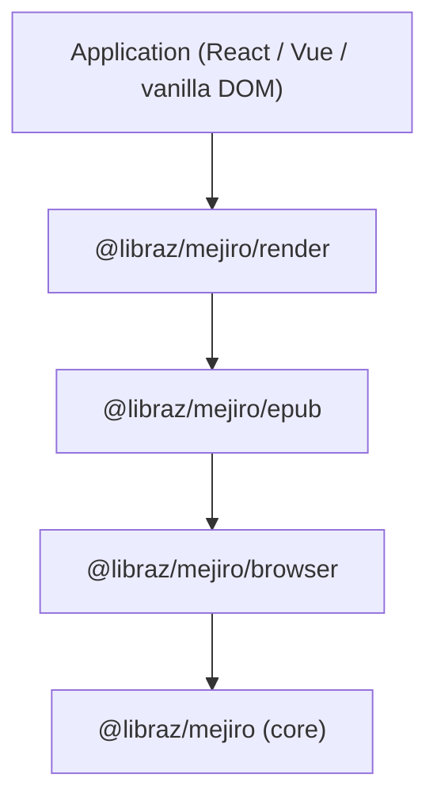
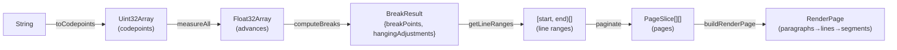

# Core Concepts

This document covers the fundamental architecture and design decisions behind mejiro.

## 1. Architecture Overview

mejiro is organized into four layers, each with a clear responsibility. Higher layers depend on lower layers but never the reverse.



### Core (`@libraz/mejiro`)

The pure computation layer. Handles line breaking, kinsoku shori (line break prohibition rules), hanging punctuation, ruby preprocessing, and pagination. It operates entirely on typed arrays and has **zero external dependencies**. It requires no DOM, no Canvas, and no I/O -- the same code runs in Node.js, workers, and edge runtimes.

### Browser (`@libraz/mejiro/browser`)

Bridges the gap between the core engine's typed arrays and the browser's string-based APIs. Responsibilities include:

- **Font loading** via the FontFace API (`document.fonts.load`)
- **Character measurement** via `Canvas.measureText`, producing the `Float32Array` of advance widths that the core engine requires
- **Width caching** with a two-level `Map<fontKey, Map<codepoint, width>>` so each character is measured at most once per font
- **Ruby font derivation** -- automatically computes the ruby font size (typically half the base font size)

### EPUB (`@libraz/mejiro/epub`)

Parses EPUB files and extracts text with ruby (furigana) annotations. The parsing pipeline follows the EPUB specification: ZIP -> `container.xml` -> OPF package document -> spine order -> XHTML content documents. Ruby annotations (`<ruby>` / `<rt>` elements) are extracted and converted into the `RubyInputAnnotation` format that the browser layer accepts. Depends on `jszip` for ZIP extraction.

### Render (`@libraz/mejiro/render`)

Converts layout results into a framework-agnostic `RenderPage` data structure. This structure describes pages as a hierarchy of paragraphs, lines, and segments -- ready for any rendering framework to consume. Also provides `mejiro.css` with the base styles needed for vertical text display.

## 2. TypedArray-Based API

mejiro represents text as `Uint32Array` (codepoints) and `Float32Array` (advance widths) rather than JavaScript strings and number arrays. This is a deliberate design choice.

### Why not strings?

JavaScript strings use UTF-16 encoding. Characters outside the Basic Multilingual Plane (BMP) -- such as CJK Extension B characters, emoji, and rare kanji -- are represented as **surrogate pairs**, meaning a single character occupies two positions in the string. This makes indexing unreliable: `str[i]` may return half of a character.

`Uint32Array` stores one Unicode codepoint per element regardless of whether the character is in the BMP or not. This gives consistent O(1) indexing over characters.

### Why Float32Array for advances?

Each element in the advances array corresponds to the measured advance width (in pixels) of the codepoint at the same index. `Float32Array` provides compact storage and avoids boxing overhead compared to a regular `number[]`.

### Conversion

The `toCodepoints()` function converts a JavaScript string to a `Uint32Array`:

```ts
import { toCodepoints } from '@libraz/mejiro';

const str = '𠮷野家'; // 𠮷 is a non-BMP character (U+20BB7)
str.length;           // 4 (UTF-16: surrogate pair + 2 chars)

const cps = toCodepoints(str);
cps.length;           // 3 (one codepoint per character)
cps[0];               // 0x20BB7
```

The typed array pair (`Uint32Array` for codepoints + `Float32Array` for advances) enables efficient sequential processing through the line breaking algorithm without any string allocation or surrogate pair handling.

## 3. Layout Pipeline

The full layout pipeline transforms a string into renderable page data in six steps:



### Step 1: `toCodepoints()`

Converts a JavaScript string into a `Uint32Array` of Unicode codepoints. This normalizes surrogate pairs into single entries, giving a 1:1 mapping between array indices and characters.

### Step 2: `CharMeasurer.measureAll()`

Measures each codepoint's advance width using the browser's `Canvas.measureText` API. Returns a `Float32Array` where `advances[i]` is the width (in pixels) of `codepoints[i]`. Results are cached per font key and codepoint so repeated characters are only measured once.

### Step 3: `computeBreaks()`

The core line breaking algorithm. Takes a `LayoutInput` (codepoints, advances, line width, and optional settings) and produces a `BreakResult` containing:

- `breakPoints` (`Uint32Array`) -- indices where lines break
- `hangingAdjustments` (`Float32Array`) -- per-line overhang amount for hanging punctuation
- `effectiveAdvances` (`Float32Array`) -- per-character advances after ruby width distribution (present only when ruby annotations are provided)

The algorithm is **greedy O(n)** with backtracking limited to kinsoku rule resolution. See [Line Breaking](03-line-breaking.md) for details.

### Step 4: `getLineRanges()`

Converts the flat `breakPoints` array into an array of `[start, end)` pairs, where each pair represents the codepoint range of one line.

### Step 5: `paginate()`

Distributes lines across fixed-size pages. Takes line ranges, paragraph measures, and page dimensions, and returns `PageSlice[][]` -- an array of pages, each containing slices of paragraphs.

### Step 6: `buildRenderPage()`

Converts a `PageSlice[]` into a `RenderPage` structure: a tree of paragraphs, lines, and segments with all the positioning data a renderer needs. This is the final, framework-agnostic output that React, Vue, or vanilla DOM code consumes.

## 4. Determinism

mejiro's core is fully deterministic:

- **Same input, same output.** Given identical codepoints, advances, line width, and options, `computeBreaks` always produces the same break points.
- **No global state.** All computation depends solely on the function arguments. There are no module-level variables that affect output.
- **No randomness.** The greedy algorithm is entirely predictable.
- **Pure computation.** The core module (`@libraz/mejiro`) performs no DOM access, no Canvas calls, and no I/O. It is a pure function from typed arrays to typed arrays.

This makes the core suitable for use in workers, server-side rendering, snapshot testing, and any environment where reproducibility matters.

## 5. Vertical Text and CSS

Japanese vertical text layout is achieved through CSS `writing-mode: vertical-rl`, which makes text flow top-to-bottom with columns progressing right-to-left.

### How dimensions map

In vertical layout, the terminology shifts:

| Concept | Horizontal layout | Vertical layout |
|---|---|---|
| Inline direction | left to right | top to bottom |
| Block direction | top to bottom | right to left |
| `lineWidth` for mejiro | container **width** | container **height** |

The `lineWidth` parameter passed to `computeBreaks` corresponds to the **height** of the container element -- the inline dimension in vertical mode.

### Safety margin

There is a subtle discrepancy between `Canvas.measureText` (which returns horizontal advance widths) and the actual vertical advance used by the browser's CSS layout engine. Over a full column of ~40 characters, this difference can accumulate and cause overflow.

The `verticalLineWidth()` function compensates by subtracting a safety margin proportional to the font size:

```ts
verticalLineWidth(containerHeight, fontSize)
// returns containerHeight - fontSize * 0.5
```

Always use `verticalLineWidth()` (or `MejiroBrowser.verticalLineWidth()`) to compute the `lineWidth` for vertical text. Passing `containerHeight` directly will likely cause column overflow.

### CSS setup

The `mejiro.css` stylesheet (provided by `@libraz/mejiro/render`) sets up the required CSS properties. The `mejiro-page` class applies `writing-mode: vertical-rl` along with other properties needed for correct vertical rendering.

---

Next: [Line Breaking](03-line-breaking.md) -- the `computeBreaks` algorithm, kinsoku shori, and hanging punctuation.

[Back to documentation index](README.md)
