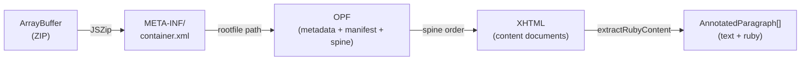

# EPUB Parsing

The `@libraz/mejiro/epub` subpath export provides functions for parsing EPUB files into structured data with ruby annotations, ready for layout and rendering.

## parseEpub()

The main entry point for EPUB parsing. Accepts an `ArrayBuffer` containing the EPUB file (which is a ZIP archive) and returns a promise resolving to an `EpubBook`.

```ts
import { parseEpub } from '@libraz/mejiro/epub';

const book = await parseEpub(epubArrayBuffer);
console.log(book.title);   // Book title from OPF metadata
console.log(book.author);  // Author (optional)
console.log(book.chapters.length);
```

## Internal Flow

The following diagram shows how `parseEpub()` transforms an EPUB file into structured paragraph data:



Steps:

1. **Unzip** -- The EPUB file is decompressed using JSZip.
2. **container.xml** -- `META-INF/container.xml` is read to locate the rootfile path (the OPF file).
3. **OPF parsing** -- The OPF file is parsed to extract metadata (`dc:title`, `dc:creator`) and the spine (reading order of content documents). A manifest map (id to href) is built to resolve spine itemrefs to file paths.
4. **XHTML extraction** -- For each spine item, the corresponding XHTML content document is read from the ZIP archive.
5. **Paragraph extraction** -- `extractRubyContent()` walks the DOM of each XHTML document, collecting base text and ruby annotations into `AnnotatedParagraph[]`. The first heading element (`h1`, `h2`, or `h3`) found in each document is used as the chapter title.

Empty chapters (those with no paragraphs after extraction) are omitted from the result.

## Data Model

```ts
interface EpubBook {
  title: string;          // From OPF dc:title
  author?: string;        // From OPF dc:creator
  chapters: EpubChapter[];
}

interface EpubChapter {
  title?: string;         // From h1/h2/h3 in the XHTML
  paragraphs: AnnotatedParagraph[];
}

interface AnnotatedParagraph {
  text: string;                          // Base text (ruby text stripped)
  rubyAnnotations: RubyInputAnnotation[]; // Ruby annotations with string indices
  headingLevel?: number;                  // 1-6 if from h1-h6 element
}
```

`RubyInputAnnotation` is defined in `@libraz/mejiro/browser` and has the following shape:

```ts
interface RubyInputAnnotation {
  startIndex: number;          // Start index in base text (character index, not byte)
  endIndex: number;            // End index (exclusive)
  rubyText: string;            // Ruby text string
  type?: 'mono' | 'group' | 'jukugo';  // Defaults to 'mono'
  jukugoSplitPoints?: number[];         // For jukugo ruby only
}
```

## extractRubyContent()

Low-level function to extract paragraphs from an XHTML string. Used internally by `parseEpub()` but also available for direct use.

```ts
import { extractRubyContent } from '@libraz/mejiro/epub';

const xhtml = `<html><body>
  <p><ruby>漢字<rt>かんじ</rt></ruby>を読む</p>
  <h2>第二章</h2>
  <p>本文です。</p>
</body></html>`;

const paragraphs = extractRubyContent(xhtml);
// paragraphs[0].text === '漢字を読む'
// paragraphs[0].rubyAnnotations === [{ startIndex: 0, endIndex: 2, rubyText: 'かんじ', type: 'group' }]
// paragraphs[1].text === '第二章'
// paragraphs[1].headingLevel === 2
// paragraphs[2].text === '本文です。'
```

### Block-level elements

The following elements create paragraph boundaries: `p`, `div`, `h1`--`h6`, `blockquote`, `li`, `dt`, `dd`, `figcaption`.

If the XHTML document contains no block-level elements, the entire body is treated as a single paragraph.

### Ruby handling

- `<ruby>base<rt>reading</rt></ruby>` produces a mono annotation (single base character) or group annotation (multiple base characters).
- `<rp>` elements are ignored entirely.
- `<rb>` elements are treated as base text.
- Multiple base-rt pairs within a single `<ruby>` element produce individual annotations for each pair, plus an additional jukugo-level annotation spanning the entire ruby group with `jukugoSplitPoints` indicating where line breaks are permitted within the base text.
- Other inline elements inside `<ruby>` are treated as base text.
- Trailing base text inside `<ruby>` with no following `<rt>` is emitted as plain text without a ruby annotation.

### Character indexing

Indices in `RubyInputAnnotation` are character indices (counting Unicode characters, not UTF-16 code units). Surrogate pairs are counted as a single character.

## Loading EPUB Files

### From File Input

```ts
const input = document.createElement('input');
input.type = 'file';
input.accept = '.epub';
input.addEventListener('change', async () => {
  const file = input.files?.[0];
  if (!file) return;
  const buffer = await file.arrayBuffer();
  const book = await parseEpub(buffer);
});
```

### From Drag and Drop

```ts
document.addEventListener('drop', async (e) => {
  e.preventDefault();
  const file = e.dataTransfer?.files[0];
  if (!file?.name.endsWith('.epub')) return;
  const buffer = await file.arrayBuffer();
  const book = await parseEpub(buffer);
});
```

### From fetch

```ts
const response = await fetch('/books/example.epub');
const buffer = await response.arrayBuffer();
const book = await parseEpub(buffer);
```

## Using EPUB with Layout

Complete example showing the full pipeline from EPUB parsing through layout to render-ready page data:

```ts
import { parseEpub } from '@libraz/mejiro/epub';
import { MejiroBrowser, verticalLineWidth } from '@libraz/mejiro/browser';
import { paginate } from '@libraz/mejiro';
import { buildParagraphMeasures, buildRenderPage } from '@libraz/mejiro/render';
import type { RenderEntry } from '@libraz/mejiro/render';

const mejiro = new MejiroBrowser({
  fixedFontFamily: '"Noto Serif JP"',
  fixedFontSize: 16,
});

const book = await parseEpub(buffer);
const chapter = book.chapters[0];

const result = await mejiro.layoutChapter({
  paragraphs: chapter.paragraphs.map((p) => ({
    text: p.text,
    rubyAnnotations: p.rubyAnnotations,
    fontSize: p.headingLevel ? 22 : undefined,
  })),
  lineWidth: mejiro.verticalLineWidth(600),
});

const entries: RenderEntry[] = chapter.paragraphs.map((p, i) => ({
  chars: result.paragraphs[i].chars,
  breakPoints: result.paragraphs[i].breakResult.breakPoints,
  rubyAnnotations: p.rubyAnnotations,
  isHeading: !!p.headingLevel,
}));

const measures = buildParagraphMeasures(entries, { fontSize: 16, lineHeight: 1.8 });
const pages = paginate(400, measures);
const renderPage = buildRenderPage(pages[0], entries);
```

## Dependencies

The `@libraz/mejiro/epub` module depends on [JSZip](https://stuk.github.io/jszip/) for ZIP decompression and uses `DOMParser` for XML/XHTML parsing (available in all browsers and in server-side runtimes that provide a DOM implementation such as happy-dom or jsdom).

---

## Related Documentation

- [Getting Started](./01-getting-started.md) -- Installation and basic usage
- [Core Concepts](./02-core-concepts.md) -- TypedArray-based API, codepoint processing
- [Line Breaking](./03-line-breaking.md) -- Kinsoku, hanging punctuation, ruby preprocessing
