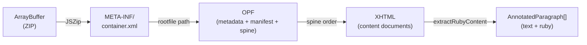

# EPUB Parsing and Authoring

The `@libraz/mejiro/epub` subpath export provides functions for parsing EPUB files into structured data with inline annotations, editing existing EPUBs, and building new EPUB 3 packages from manuscript text.

## parseEpub()

The main entry point for EPUB parsing. Accepts an `ArrayBuffer` containing the EPUB file (which is a ZIP archive) and returns a promise resolving to an `EpubBook`.

```ts
import { parseEpub } from '@libraz/mejiro/epub';

const book = await parseEpub(epubArrayBuffer);
console.log(book.title);   // Book title from OPF metadata
console.log(book.author);  // Author (optional)
console.log(book.chapters.length);
```

## Internal Flow

The following diagram shows how `parseEpub()` transforms an EPUB file into structured paragraph data:


```mermaid
flowchart LR
    ZIP["ArrayBuffer\n(ZIP)"] -->|JSZip| C["META-INF/\ncontainer.xml"]
    C -->|rootfile path| OPF["OPF\n(metadata + manifest + spine)"]
    OPF -->|spine order| XHTML["XHTML\n(content documents)"]
    XHTML -->|extractRubyContent| AP["AnnotatedParagraph[]\n(text + ruby)"]
```

Steps:

1. **Unzip** -- The EPUB file is decompressed using JSZip.
2. **container.xml** -- `META-INF/container.xml` is read to locate the rootfile path (the OPF file).
3. **OPF parsing** -- The OPF file is parsed to extract metadata (`dc:title`, `dc:creator`) and the spine (reading order of content documents). A manifest map (id to href) is built to resolve spine itemrefs to file paths.
4. **XHTML extraction** -- For each spine item, the corresponding XHTML content document is read from the ZIP archive.
5. **Paragraph extraction** -- `extractRubyContent()` walks the DOM of each XHTML document, collecting base text and ruby annotations into `AnnotatedParagraph[]`. The first heading element (`h1`, `h2`, or `h3`) found in each document is used as the chapter title.

Empty chapters (those with no paragraphs after extraction) are omitted from the result.

## Data Model

```ts
interface EpubBook {
  title: string;          // From OPF dc:title
  author?: string;        // From OPF dc:creator
  chapters: EpubChapter[];
}

interface EpubChapter {
  title?: string;         // From h1/h2/h3 in the XHTML
  paragraphs: AnnotatedParagraph[];
}

interface AnnotatedParagraph {
  text: string;                             // Base text (ruby text stripped)
  inlineAnnotations: InlineAnnotation[];    // Ruby / emphasis / tcy / links / notes
  headingLevel?: number;                    // 1-6 if from h1-h6 element
}
```

Ruby is represented as the `kind: 'ruby'` variant of `InlineAnnotation`, defined in `@libraz/mejiro/browser`:

```ts
interface InlineRubyAnnotation {
  kind: 'ruby';
  startIndex: number;                  // Character index, not byte offset
  endIndex: number;                    // Exclusive
  rubyText: string;
  type?: 'mono' | 'group' | 'jukugo';
  jukugoSplitPoints?: number[];
}
```

When authoring from plain manuscript text, `parseManuscript(text, { dialect })` extracts ruby, emphasis dots, tate-chu-yoko, and other inline annotations in one pass. The full list of markers recognized by each dialect is summarized in [Manuscript notation dialects (parseManuscript)](#manuscript-notation-dialects-parsemanuscript) below.

## extractRubyContent()

Low-level function to extract paragraphs from an XHTML string. Used internally by `parseEpub()` but also available for direct use.

```ts
import { extractRubyContent } from '@libraz/mejiro/epub';

const xhtml = `<html><body>
  <p><ruby>漢字<rt>かんじ</rt></ruby>を読む</p>
  <h2>第二章</h2>
  <p>本文です。</p>
</body></html>`;

const paragraphs = extractRubyContent(xhtml);
// paragraphs[0].text === '漢字を読む'
// paragraphs[0].inlineAnnotations === [
//   { kind: 'ruby', startIndex: 0, endIndex: 2, rubyText: 'かんじ', type: 'group' }
// ]
// paragraphs[1].text === '第二章'
// paragraphs[1].headingLevel === 2
// paragraphs[2].text === '本文です。'
```

### Block-level elements

The following elements create paragraph boundaries: `p`, `div`, `h1`--`h6`, `blockquote`, `li`, `dt`, `dd`, `figcaption`.

If the XHTML document contains no block-level elements, the entire body is treated as a single paragraph.

### Ruby handling

- `<ruby>base<rt>reading</rt></ruby>` produces a mono annotation (single base character) or group annotation (multiple base characters).
- `<rp>` elements are ignored entirely.
- `<rb>` elements are treated as base text.
- Multiple base-rt pairs within a single `<ruby>` element produce individual annotations for each pair, plus an additional jukugo-level annotation spanning the entire ruby group with `jukugoSplitPoints` indicating where line breaks are permitted within the base text.
- Other inline elements inside `<ruby>` are treated as base text.
- Trailing base text inside `<ruby>` with no following `<rt>` is emitted as plain text without a ruby annotation.

### Character indexing

Indices in `InlineRubyAnnotation` are character indices (counting Unicode characters, not UTF-16 code units). Surrogate pairs are counted as a single character.

## Loading EPUB Files

### From File Input

```ts
const input = document.createElement('input');
input.type = 'file';
input.accept = '.epub';
input.addEventListener('change', async () => {
  const file = input.files?.[0];
  if (!file) return;
  const buffer = await file.arrayBuffer();
  const book = await parseEpub(buffer);
});
```

### From Drag and Drop

```ts
document.addEventListener('drop', async (e) => {
  e.preventDefault();
  const file = e.dataTransfer?.files[0];
  if (!file?.name.endsWith('.epub')) return;
  const buffer = await file.arrayBuffer();
  const book = await parseEpub(buffer);
});
```

### From fetch

```ts
const response = await fetch('/books/example.epub');
const buffer = await response.arrayBuffer();
const book = await parseEpub(buffer);
```

## Using EPUB with Layout

Complete example showing the full pipeline from EPUB parsing through layout to render-ready page data:

```ts
import { parseEpub } from '@libraz/mejiro/epub';
import { MejiroBrowser, verticalLineWidth } from '@libraz/mejiro/browser';
import { paginate } from '@libraz/mejiro';
import { buildParagraphMeasures, buildRenderPage } from '@libraz/mejiro/render';
import type { RenderEntry } from '@libraz/mejiro/render';

const mejiro = new MejiroBrowser({
  fixedFontFamily: '"Noto Serif JP"',
  fixedFontSize: 16,
});

const book = await parseEpub(buffer);
const chapter = book.chapters[0];

const result = await mejiro.layoutChapter({
  paragraphs: chapter.paragraphs.map((p) => ({
    text: p.text,
    inlineAnnotations: p.inlineAnnotations,
    fontSize: p.headingLevel ? 22 : undefined,
  })),
  lineWidth: mejiro.verticalLineWidth(600),
});

const entries: RenderEntry[] = chapter.paragraphs.map((p, i) => ({
  chars: result.paragraphs[i].chars,
  breakPoints: result.paragraphs[i].breakResult.breakPoints,
  inlineAnnotations: p.inlineAnnotations,
  isHeading: !!p.headingLevel,
}));

const measures = buildParagraphMeasures(entries, { fontSize: 16, lineHeight: 1.8 });
const pages = paginate(400, measures);
const renderPage = buildRenderPage(pages[0], entries);
```

## Editing Existing EPUBs

Use `parseEditableEpub()` / `EditableEpub` when you need to patch an existing package and export it again:

```ts
import { parseEditableEpub } from '@libraz/mejiro/epub';

const editor = await parseEditableEpub(buffer);

editor.updateParagraph(0, 2, {
  text: '差し替え後の本文',
  inlineAnnotations: [
    { kind: 'ruby', startIndex: 5, endIndex: 7, rubyText: 'ほんぶん', type: 'group' },
  ],
});

const nextBuffer = await editor.export({
  onProgress(stage, ratio) {
    console.log(stage, ratio);
  },
});
```

Editable chapters expose block-level content through `chapter.blocks`, where paragraph blocks and image blocks are siblings. Legacy paragraph arrays are still projected for read-only compatibility, but new editor code should mutate blocks through `EditableEpub` methods.

### Migrating to the v0.5 block-based API

In `v0.5` the canonical chapter content lives in `blocks: EditableBlock[]` — a mixed array of `EditableParagraphBlock` and `EditableImageBlock`. The `paragraphs` / `paragraphRefs` / `images` fields are deprecated read-only projections that are regenerated from `blocks` after every mutation. **All three projections are scheduled for removal in `v0.6`**, so new integrations should use the block-based methods below.

| v0.4 / legacy API | v0.5 recommended API | Notes |
|-------------------|----------------------|-------|
| Mutate `chapter.paragraphs[i]` directly | `editor.updateParagraph(chapterIdx, paragraphIdx, patch)` | `paragraphIdx` indexes the paragraph projection (image blocks skipped). |
| `chapter.paragraphs.splice(i, 0, p)` | `editor.insertParagraph(chapterIdx, atIndex, partial)` | `atIndex` indexes `chapter.blocks`. Append with `chapter.blocks.length`. |
| `chapter.paragraphs.splice(i, 1)` | `editor.deleteBlock(chapterIdx, blockId)` | Works for both paragraph and image blocks. Removing the last reference to an image asset also drops it from `imageAssets`. |
| Split a paragraph at a position | `editor.splitParagraph(chapterIdx, blockId, charIndex)` | Returns `[leftId, rightId]`. Annotations straddling the split are dropped intentionally. |
| Merge adjacent paragraphs | `editor.mergeParagraphs(chapterIdx, leftId, rightId)` | `rightId` must be immediately after `leftId`. |
| `chapter.images.push(...)` | `editor.addImage(chapterIdx, { filename, data, alt?, caption?, placement? })` | Returns the generated `assetKey`. The legacy `{ href, mediaType, ... }` shape is still accepted but will be removed. |
| `chapter.images.splice(i, 1)` | `editor.removeImage(chapterIdx, blockIdOrAssetKey)` | Identify by either block id or asset key. |
| Patch image alt / caption / placement | `editor.updateImage(chapterIdx, blockId, patch)` / `setImageCaption(...)` | |
| Reorder paragraphs or images | `editor.moveBlock(chapterIdx, blockId, toIndex)` | `toIndex` is the target index in `blocks`. |
| Inspect `paragraphRefs[i].tagName` | (removed) | The source XHTML tag is no longer tracked. The exported tag is derived from `paragraphKind` / `headingLevel`. |

#### Paragraph projection vs block indices

`updateParagraph` / `setInlineAnnotations` accept paragraph-only indices, whereas `insertParagraph` / `moveBlock` accept block indices that include images. For operations that interleave the two, walk `chapter.blocks` directly:

```ts
for (const [index, block] of editor.book.chapters[0].blocks.entries()) {
  if (block.kind === 'paragraph' && block.text.includes(query)) {
    editor.updateParagraph(0, paragraphIndexOf(editor.book.chapters[0], index), {
      text: block.text.replaceAll(query, replacement),
    });
  }
}
```

#### Undo/redo, transactions, and progress

`v0.5` groups multiple operations through `editor.transaction(fn)` and exposes history via `editor.undo()` / `editor.redo()` / `editor.history`. `editor.export({ onProgress, signal })` also accepts a progress callback and an `AbortSignal`, so large EPUB writes can report status and be cancelled from the host UI.

#### URL-only image registration (assetResolver)

`addImage()` accepts `{ filename, url }` as an alternative to `{ filename, data }`. The bytes are only resolved when `editor.export({ assetResolver })` runs, so the editor session can hold remote URLs without ever materializing the image bytes client-side.

```ts
editor.addImage(0, {
  filename: 'figure-01.png',
  url: 'https://cdn.example.com/works/1/figure-01.png',
  alt: 'figure',
});

const buffer = await editor.export({
  assetResolver: async ({ assetKey, url, signal }) => {
    const res = await fetch(url, { signal });
    if (!res.ok) throw new Error(`asset ${assetKey} failed: ${res.status}`);
    return res.arrayBuffer();
  },
});
```

When `assetResolver` is omitted, the runtime `fetch(url, { signal })` is used by default. See [09-advanced.md §7.4](09-advanced.md#74-delivering-image-assets-assetresolver) for the end-to-end novel-posting-site pattern.

## Building EPUBs from Manuscript Text

`EpubProject` creates a new EPUB 3 package from chapter drafts. Manuscript ruby uses Aozora-style notation such as `｜漢字《かんじ》`.

```ts
import { EpubProject } from '@libraz/mejiro/epub';

const project = new EpubProject({
  metadata: {
    title: '新しい作品',
    creators: [{ name: '作者名', role: 'aut' }],
    language: 'ja',
  },
  chapters: [
    {
      title: '第一話',
      body: 'これは｜漢字《かんじ》のルビ例です。\n\n本文を続けます。',
    },
  ],
});

project.addChapter({ title: '第二話', body: '続きの本文です。' });
const epubBuffer = await project.export();
```

## Manuscript notation dialects (parseManuscript)

`parseManuscript(text, options)` consumes one manuscript paragraph and returns `text` (the base text) plus `inlineAnnotations` (the array of inline annotations). `options.dialect` selects which markers are recognized — the default is `'mejiro'`.

```ts
import { parseManuscript } from '@libraz/mejiro/epub';

parseManuscript('｜漢字《かんじ》を読む');                       // defaults to 'mejiro'
parseManuscript('｜漢字《かんじ》を読む', { dialect: 'narou' });
parseManuscript('｜漢字《かんじ》を読む', { dialect: 'kakuyomu' });
```

`EpubProject.fromManuscript()` and `<MejiroManuscriptEditor>` / `useManuscriptDraft()` call `parseManuscript()` internally, so passing `dialect` to those APIs switches interpretation for the whole manuscript.

### Marker support per dialect

| Marker | Example | Emitted annotation | `mejiro` (default) | `narou` | `kakuyomu` |
|--------|---------|--------------------|:--:|:--:|:--:|
| Pipe ruby | `｜漢字《かんじ》` | `kind: 'ruby'` | ✅ | ✅ | ✅ |
| Auto ruby (kanji + 《》) | `漢字《かんじ》` | `kind: 'ruby'` | ✅ | ✅ | ✅ |
| Emphasis dots (sesame) | `《《重要》》` | `kind: 'emphasis'` (`style: 'sesame'`) | ✅ | — | — |
| Tate-chu-yoko | `〔20〕` | `kind: 'tcy'` | ✅ | — | — |
| Footnote reference | `[[#note-1]]` | `kind: 'footnote'` | ✅ | — | — |
| Link | `[label](https://example.com)` | `kind: 'link'` | ✅ | — | — |
| Strong | `**text**` | `kind: 'strong'` | ✅ | — | — |
| Emphasis (italic) | `*text*` | `kind: 'em'` | ✅ | — | — |

`narou` and `kakuyomu` currently behave identically — both restrict parsing to Aozora-compatible ruby. Choose one of them when ingesting manuscripts copied from those sites verbatim, or when you want `*` / `[]` characters to survive as literal body text. Under those dialects, sequences such as `**text**` or `〔20〕` flow through to the body without producing annotations.

### Marker semantics and constraints

- **Auto ruby**: the base text must be a contiguous run of `Script=Han` (kanji) characters or one of `々〆ヶ`. Hiragana, katakana, and symbols do not trigger auto ruby — use the pipe form (`｜...《...》`) for those.
- **Pipe ruby**: any base text is allowed. The parser tries pipe ruby before auto ruby, so prefix `｜` whenever you need ruby over non-kanji.
- **Emphasis dots**: if the matching `》》` cannot be found, the literal `《《...` flows through as plain text. The emitted annotation uses `style: 'sesame'`; for other styles (e.g. `dot`), build the `InlineAnnotation` directly.
- **Tate-chu-yoko**: the body inside `〔...〕` must match `[A-Za-z0-9!?]+` and the whole bracket region must be at most 6 characters wide (brackets included). Mixed Japanese or longer payloads fall through as literal body text.
- **Footnote reference**: the body text receives `*<id>` (e.g. `*note-1`) plus the matching `kind: 'footnote'` annotation. Managing the footnote target itself is left to the host application.
- **Link**: both `[label](href)` and `[label](href "title")` are accepted. The `href` is a single whitespace-free token and `title` must be double-quoted.
- **Strong / Emphasis**: `**` is tried before `*`. Nested forms such as `***text***` do not nest cleanly (the outer `**` becomes `strong` and the leftover `*` remains as text). Build `InlineAnnotation`s by hand for compound styles.

### Filtering inline annotations from imported manuscripts

The legacy `parseManuscriptRuby()` helper is a thin wrapper that returns ruby annotations only. It is scheduled for removal in v0.6. New code should call `parseManuscript()` and narrow on `kind`:

```ts
import { parseManuscript } from '@libraz/mejiro/epub';

const { text, inlineAnnotations } = parseManuscript(rawText, { dialect: 'narou' });
const rubyOnly = inlineAnnotations.filter((ann) => ann.kind === 'ruby');
```

## Dependencies

The `@libraz/mejiro/epub` module depends on [JSZip](https://stuk.github.io/jszip/) for ZIP decompression and uses `DOMParser` for XML/XHTML parsing (available in all browsers and in server-side runtimes that provide a DOM implementation such as happy-dom or jsdom).

---

## Related Documentation

- [Getting Started](./01-getting-started.md) -- Installation and basic usage
- [Core Concepts](./02-core-concepts.md) -- TypedArray-based API, codepoint processing
- [Line Breaking](./03-line-breaking.md) -- Kinsoku, hanging punctuation, ruby preprocessing
