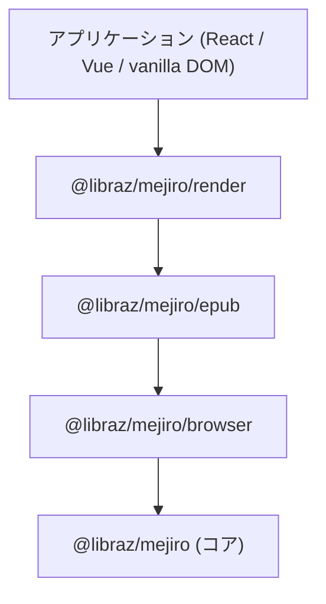
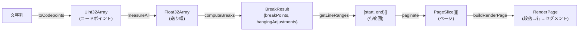

# コアコンセプト

本ドキュメントでは、mejiroの基本的なアーキテクチャと設計上の意思決定について解説します。

## 1. アーキテクチャ概要

mejiroは4つのレイヤーで構成されており、それぞれ明確な責務を持っています。上位レイヤーは下位レイヤーに依存しますが、その逆はありません。



### コア (`@libraz/mejiro`)

純粋な計算レイヤーです。改行処理、禁則処理（行頭・行末禁則）、ぶら下げ組み、ルビの前処理、およびページ分割を担当します。すべての処理は型付き配列上で行われ、**外部依存はゼロ**です。DOM、Canvas、I/Oを必要とせず、同じコードがNode.js、Web Worker、エッジランタイムで動作します。

### ブラウザ (`@libraz/mejiro/browser`)

コアエンジンの型付き配列とブラウザの文字列ベースAPIとの橋渡しを行います。主な責務は以下の通りです:

- FontFace API（`document.fonts.load`）による**フォント読み込み**
- `Canvas.measureText`による**文字幅計測**。コアエンジンが必要とする`Float32Array`の送り幅データを生成します
- 二階層の`Map<fontKey, Map<codepoint, width>>`による**幅のキャッシュ**。各文字はフォントごとに最大1回だけ計測されます
- **ルビフォントサイズの自動算出** -- 通常、基底フォントサイズの半分のルビフォントサイズを自動計算します

### EPUB (`@libraz/mejiro/epub`)

EPUBファイルを解析し、ルビ（ふりがな）注釈付きのテキストを抽出します。解析パイプラインはEPUB仕様に準拠しています: ZIP -> `container.xml` -> OPFパッケージドキュメント -> spine順序 -> XHTMLコンテンツドキュメント。ルビ注釈（`<ruby>` / `<rt>`要素）は抽出され、ブラウザレイヤーが受け取る`RubyInputAnnotation`形式に変換されます。ZIP展開に`jszip`を使用します。

### レンダー (`@libraz/mejiro/render`)

レイアウト結果をフレームワーク非依存の`RenderPage`データ構造に変換します。この構造はページを段落、行、セグメントの階層として記述し、あらゆるレンダリングフレームワークから利用できる形式です。また、縦書きテキスト表示に必要な基本スタイルを含む`mejiro.css`も提供します。

## 2. TypedArrayベースAPI

mejiroはテキストをJavaScript文字列や数値配列ではなく、`Uint32Array`（コードポイント）と`Float32Array`（送り幅）で表現します。これは意図的な設計選択です。

### なぜ文字列を使わないのか?

JavaScript文字列はUTF-16エンコーディングを使用しています。基本多言語面（BMP）外の文字 -- CJK拡張B漢字、絵文字、希少漢字など -- は**サロゲートペア**として表現され、1文字が文字列内の2つの位置を占めます。このため、インデックスによるアクセスが不安定になります: `str[i]`は文字の半分を返す可能性があります。

`Uint32Array`はBMP内かどうかに関わらず、1要素に1つのUnicodeコードポイントを格納します。これにより、文字に対する一貫したO(1)インデックスアクセスが可能になります。

### なぜFloat32Arrayを使うのか?

送り幅配列の各要素は、同じインデックスのコードポイントの計測された送り幅（ピクセル単位）に対応します。`Float32Array`は通常の`number[]`と比較して、コンパクトなストレージとボクシングオーバーヘッドの回避を実現します。

### 変換

`toCodepoints()`関数はJavaScript文字列を`Uint32Array`に変換します:

```ts
import { toCodepoints } from '@libraz/mejiro';

const str = '𠮷野家'; // 𠮷はBMP外の文字 (U+20BB7)
str.length;           // 4 (UTF-16: サロゲートペア + 2文字)

const cps = toCodepoints(str);
cps.length;           // 3 (1文字につき1コードポイント)
cps[0];               // 0x20BB7
```

型付き配列のペア（コードポイント用の`Uint32Array` + 送り幅用の`Float32Array`）により、文字列のアロケーションやサロゲートペアの処理なしに、改行アルゴリズムを効率的に逐次処理できます。

## 3. レイアウトパイプライン

完全なレイアウトパイプラインは、文字列をレンダリング可能なページデータに6つのステップで変換します:



### ステップ1: `toCodepoints()`

JavaScript文字列をUnicodeコードポイントの`Uint32Array`に変換します。サロゲートペアを単一のエントリに正規化し、配列インデックスと文字の1:1対応を実現します。

### ステップ2: `CharMeasurer.measureAll()`

ブラウザの`Canvas.measureText` APIを使用して各コードポイントの送り幅を計測します。`advances[i]`が`codepoints[i]`の幅（ピクセル単位）となる`Float32Array`を返します。結果はフォントキーとコードポイントごとにキャッシュされるため、繰り返し出現する文字は1回だけ計測されます。

### ステップ3: `computeBreaks()`

コアの改行アルゴリズムです。`LayoutInput`（コードポイント、送り幅、行幅、およびオプション設定）を受け取り、以下を含む`BreakResult`を生成します:

- `breakPoints` (`Uint32Array`) -- 行が折り返されるインデックス
- `hangingAdjustments` (`Float32Array`) -- 行ごとのぶら下げ組みによるはみ出し量
- `effectiveAdvances` (`Float32Array`) -- ルビの幅分配後の文字ごとの送り幅（ルビ注釈が指定された場合のみ存在）

アルゴリズムは禁則処理の解決に限定されたバックトラッキングを伴う**貪欲法O(n)**です。詳細は[改行処理](03-line-breaking.md)を参照してください。

### ステップ4: `getLineRanges()`

フラットな`breakPoints`配列を`[start, end)`ペアの配列に変換します。各ペアは1行のコードポイント範囲を表します。

### ステップ5: `paginate()`

行を固定サイズのページに配置します。行範囲、段落の寸法情報、ページサイズを受け取り、`PageSlice[][]` -- ページの配列で、各ページが段落のスライスを含む -- を返します。

### ステップ6: `buildRenderPage()`

`PageSlice[]`を`RenderPage`構造に変換します。段落、行、セグメントのツリーで、レンダラーが必要とするすべての配置データを含みます。これがReact、Vue、またはvanilla DOMコードが消費する最終的なフレームワーク非依存の出力です。

## 4. 決定性

mejiroのコアは完全に決定的です:

- **同じ入力には同じ出力。** 同一のコードポイント、送り幅、行幅、オプションが与えられれば、`computeBreaks`は常に同じ改行位置を生成します。
- **グローバル状態なし。** すべての計算は関数の引数のみに依存します。出力に影響するモジュールレベルの変数は存在しません。
- **ランダム性なし。** 貪欲法アルゴリズムは完全に予測可能です。
- **純粋な計算。** コアモジュール（`@libraz/mejiro`）はDOMアクセス、Canvas呼び出し、I/Oを一切行いません。型付き配列から型付き配列への純粋関数です。

これにより、コアはWeb Worker、サーバーサイドレンダリング、スナップショットテスト、および再現性が重要なあらゆる環境での使用に適しています。

## 5. 縦書きとCSS

日本語の縦書きレイアウトは、CSS `writing-mode: vertical-rl`によって実現されます。テキストは上から下に流れ、段は右から左に進みます。

### 寸法の対応関係

縦書きレイアウトでは、用語の対応が変わります:

| 概念 | 横書きレイアウト | 縦書きレイアウト |
|---|---|---|
| インライン方向 | 左から右 | 上から下 |
| ブロック方向 | 上から下 | 右から左 |
| mejiroの`lineWidth` | コンテナの**幅** | コンテナの**高さ** |

`computeBreaks`に渡す`lineWidth`パラメータは、コンテナ要素の**高さ** -- 縦書きモードにおけるインライン方向の寸法 -- に対応します。

### セーフティマージン

`Canvas.measureText`（水平方向の送り幅を返す）とブラウザのCSSレイアウトエンジンが使用する実際の縦方向の送り幅との間には、微妙な不一致があります。約40文字の1段分にわたって、この差が蓄積しオーバーフローを引き起こす可能性があります。

`verticalLineWidth()`関数は、フォントサイズに比例したセーフティマージンを差し引くことで補正します:

```ts
verticalLineWidth(containerHeight, fontSize)
// containerHeight - fontSize * 0.5 を返す
```

縦書きテキストの`lineWidth`の計算には、常に`verticalLineWidth()`（または`MejiroBrowser.verticalLineWidth()`）を使用してください。`containerHeight`を直接渡すと、段のオーバーフローが発生する可能性が高くなります。

### CSSの設定

`mejiro.css`スタイルシート（`@libraz/mejiro/render`が提供）は、必要なCSSプロパティを設定します。`mejiro-page`クラスは`writing-mode: vertical-rl`およびその他の縦書きレンダリングに必要なプロパティを適用します。

---

次へ: [改行処理](03-line-breaking.md) -- `computeBreaks`アルゴリズム、禁則処理、ぶら下げ組み。

[ドキュメント目次に戻る](README.md)
