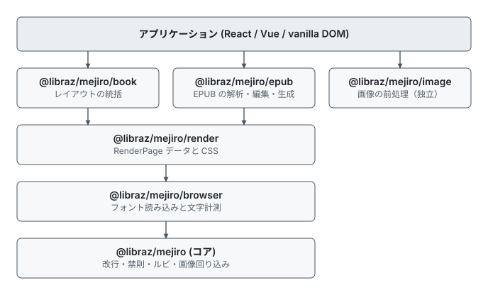

# コアコンセプト

このページでは、mejiro の基本的な構成と、設計上の考え方を説明します。

## 1. アーキテクチャ概要

mejiro はいくつかのレイヤーに分かれています。上位レイヤーは下位レイヤーを利用しますが、下位レイヤーは上位レイヤーに依存しません。必要な深さの API だけを選んで使えるようにするためです。`book` と `epub` は同じ段にある兄弟で、どちらも `render` の上に乗ります。アプリケーションはどちらからでも入れます。`image` は他のレイヤーから独立しています。



### ブック (`@libraz/mejiro/book`)

ほとんどのアプリケーションで最初に使う入口です。`MejiroBook` はフォント読み込み、文字計測、レイアウトをまとめて管理します。`ChapterLayout` はページ分割、見開きの取得、画像回り込みを遅延計算します。下位レイヤーを自分でつなぎ込む必要がないため、通常はこの API から始めるのがおすすめです。

### コア (`@libraz/mejiro`)

純粋な計算だけを行うレイヤーです。改行処理、禁則処理、ぶら下げ、ルビの前処理、ページ分割を担当します。処理は TypedArray 上で行われ、**外部依存はありません**。DOM、Canvas、I/O を使わないため、Node.js、Web Worker、エッジランタイムでも同じコードを動かせます。

### ブラウザ (`@libraz/mejiro/browser`)

コアエンジンが必要とする TypedArray と、ブラウザの文字列ベース API の間をつなぐレイヤーです。主な役割は次のとおりです。

- FontFace API（`document.fonts.load`）による**フォント読み込み**
- `Canvas.measureText` による**文字幅計測**。コアエンジンへ渡す `Float32Array` の送り幅データを作ります
- 二階層の `Map<fontKey, Map<codepoint, width>>` による**幅キャッシュ**。同じ文字はフォントごとに最大 1 回だけ計測されます
- **ルビフォントサイズの自動算出**。通常は本文フォントサイズの半分を使います

### EPUB (`@libraz/mejiro/epub`)

EPUB ファイルを解析し、本文とインライン注釈を取り出します。処理の流れは EPUB 仕様に沿っており、ZIP → `container.xml` → OPF パッケージドキュメント → spine 順 → XHTML コンテンツドキュメントの順にたどります。`<ruby>` / `<rt>` 要素は `kind: 'ruby'` の `InlineAnnotation` として抽出されます。ZIP 展開には `jszip` を使います。

### レンダリング (`@libraz/mejiro/render`)

レイアウト結果を、React や Vue に依存しない `RenderPage` データ構造へ変換します。`RenderPage` はページを段落、行、セグメントの階層で表します。縦書き表示に必要な基本スタイルを含む `mejiro.css` もここに含まれます。

### 画像 (`@libraz/mejiro/image`)

他のレイヤーから独立した、ブラウザ向けの補助レイヤーです。`prepareImage()` は画像ファイルをデコードし、指定のピクセル上限に収まるよう縮小し、バイト数の上限内に収まるよう再エンコードします。EPUB に埋め込む前処理として使います。

## 2. TypedArrayベースAPI

mejiro は、レイアウト計算中のテキストを JavaScript 文字列や `number[]` ではなく、`Uint32Array`（コードポイント）と `Float32Array`（送り幅）で扱います。これは意図的な設計です。

### なぜ文字列を使わないのか?

JavaScript 文字列は UTF-16 です。BMP 外の文字（CJK 拡張 B、絵文字、希少漢字など）は**サロゲートペア**として表現され、1 文字が文字列内の 2 つの位置を占めます。そのため、`str[i]` が文字の半分だけを返すことがあります。

`Uint32Array` なら、BMP 内外に関係なく 1 要素に 1 つの Unicode コードポイントを格納できます。これにより、文字単位のインデックスアクセスを安定して扱えます。

### なぜFloat32Arrayを使うのか?

送り幅配列の各要素は、同じインデックスにあるコードポイントの幅（px）に対応します。`Float32Array` は `number[]` よりコンパクトで、ボクシングのオーバーヘッドも避けられます。

### 変換

`toCodepoints()`関数はJavaScript文字列を`Uint32Array`に変換します:

```ts
import { toCodepoints } from '@libraz/mejiro';

const str = '𠮷野家'; // 𠮷はBMP外の文字 (U+20BB7)
str.length;           // 4 (UTF-16: サロゲートペア + 2文字)

const cps = toCodepoints(str);
cps.length;           // 3 (1文字につき1コードポイント)
cps[0];               // 0x20BB7
```

型付き配列のペア（コードポイント用の`Uint32Array` + 送り幅用の`Float32Array`）により、文字列のアロケーションやサロゲートペアの処理なしに、改行アルゴリズムを効率的に逐次処理できます。

## 3. レイアウトパイプライン

レイアウト全体の流れは、文字列を表示用のページデータへ変換する 6 つのステップです。


`getLineRanges()` は本流ではなく側枝です。`buildRenderPage()` が行ごとの文字を切り出すために内部で呼び出しており、行範囲を直接必要とする利用者向けに公開されています。`paginate()` は行範囲を受け取らず、`ParagraphMeasure[]` だけから計算します。

### ステップ1: `toCodepoints()`

JavaScript文字列をUnicodeコードポイントの`Uint32Array`に変換します。サロゲートペアを単一のエントリに正規化し、配列インデックスと文字の1:1対応を実現します。

### ステップ2: `CharMeasurer.measureAll()`

ブラウザの`Canvas.measureText` APIを使用して各コードポイントの送り幅を計測します。`advances[i]`が`codepoints[i]`の幅（ピクセル単位）となる`Float32Array`を返します。結果はフォントキーとコードポイントごとにキャッシュされるため、繰り返し出現する文字は1回だけ計測されます。

### ステップ3: `computeBreaks()`

コアの改行アルゴリズムです。`LayoutInput`（コードポイント、送り幅、行幅、およびオプション設定）を受け取り、以下を含む`BreakResult`を生成します:

- `breakPoints` (`Uint32Array`) -- 行が折り返されるインデックス
- `hangingAdjustments` (`Float32Array`) -- 行ごとのぶら下げ組みによるはみ出し量
- `effectiveAdvances` (`Float32Array`) -- ルビの幅分配後の文字ごとの送り幅（ルビ注釈が指定された場合のみ存在）

アルゴリズムは禁則処理の解決に限定されたバックトラッキングを伴う**貪欲法O(n)**です。詳細は[改行処理](03-line-breaking.md)を参照してください。

### ステップ4: `buildParagraphMeasures()`

レンダーエントリ（文字・改行位置・注釈・見出しレベル）を `ParagraphMeasure[]` に変換します。段落ごとの行数、ブロック方向の行ピッチ、段落前の間隔が入ります。ページ分割が参照するのはこのデータで、文字範囲そのものは描画まで必要になりません。

`getLineRanges(breakPoints, length)` はフラットな `breakPoints` 配列を `[start, end)` ペアに変換します。`buildRenderPage()` が内部で呼び出しており、行範囲を直接必要とする利用者向けにも公開されていますが、ページ分割の経路には含まれません。

### ステップ5: `paginate()`

行を固定サイズのページに配置します。引数は 2 つだけで、`paginate(pageBlockSize, paragraphs)` の形です（`pageBlockSize` はブロック方向に使えるサイズ＝縦組みではページ幅、`paragraphs` はステップ4 の `ParagraphMeasure[]`）。戻り値は `PageSlice[][]` で、ページの配列の各要素が段落のスライスを含みます。どのような入力でも最低 1 ページを返します。

### ステップ6: `buildRenderPage()`

`PageSlice[]` を `RenderPage` 構造に変換します。段落、行、セグメントのツリーとして、表示に必要なデータを持ちます。React、Vue、vanilla DOM から扱う最終的な出力です。

## 4. 決定性

mejiro のコアは決定的に動作します。

- **同じ入力には同じ出力。** 同一のコードポイント、送り幅、行幅、オプションが与えられれば、`computeBreaks`は常に同じ改行位置を生成します。
- **グローバル状態なし。** すべての計算は関数の引数のみに依存します。出力に影響するモジュールレベルの変数は存在しません。
- **ランダム性なし。** 貪欲法アルゴリズムは完全に予測可能です。
- **純粋な計算。** コアモジュール（`@libraz/mejiro`）はDOMアクセス、Canvas呼び出し、I/Oを一切行いません。型付き配列から型付き配列への純粋関数です。

この性質により、Web Worker、SSR、スナップショットテストなど、再現性が重要な環境でも使いやすくなっています。

## 5. 縦書きとCSS

日本語の縦書き表示には CSS の `writing-mode: vertical-rl` を使います。テキストは上から下へ流れ、段は右から左へ進みます。

### 寸法の対応関係

縦書きレイアウトでは、用語の対応が変わります:

| 概念 | 横書きレイアウト | 縦書きレイアウト |
|---|---|---|
| インライン方向 | 左から右 | 上から下 |
| ブロック方向 | 上から下 | 右から左 |
| mejiroの`lineWidth` | コンテナの**幅** | コンテナの**高さ** |

`computeBreaks`に渡す`lineWidth`パラメータは、コンテナ要素の**高さ** -- 縦書きモードにおけるインライン方向の寸法 -- に対応します。

### セーフティマージン

`Canvas.measureText`（水平方向の送り幅を返す）とブラウザのCSSレイアウトエンジンが使用する実際の縦方向の送り幅との間には、微妙な不一致があります。約40文字の1段分にわたって、この差が蓄積しオーバーフローを引き起こす可能性があります。

`verticalLineWidth()`関数は、フォントサイズに比例したセーフティマージンを差し引くことで補正します:

```ts
verticalLineWidth(containerHeight, fontSize)
// containerHeight - fontSize * 0.5 を返す
```

縦書きテキストの`lineWidth`の計算には、常に`verticalLineWidth()`（または`MejiroBrowser.verticalLineWidth()`）を使用してください。`containerHeight`を直接渡すと、段のオーバーフローが発生する可能性が高くなります。

### CSSの設定

`mejiro.css`スタイルシート（`@libraz/mejiro/render`が提供）は、必要なCSSプロパティを設定します。`mejiro-page`クラスは`writing-mode: vertical-rl`およびその他の縦書きレンダリングに必要なプロパティを適用します。

---

次へ: [改行処理](03-line-breaking.md) -- `computeBreaks`アルゴリズム、禁則処理、ぶら下げ組み。

[ドキュメント目次に戻る](README.md)
