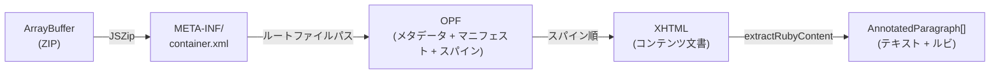

# EPUB解析

`@libraz/mejiro/epub` サブパスエクスポートは、EPUBファイルをルビ注釈付きの構造化データに変換し、レイアウトおよびレンダリングに利用できる関数を提供します。

## parseEpub()

EPUB解析のメインエントリーポイントです。EPUBファイル（ZIPアーカイブ）を含む `ArrayBuffer` を受け取り、`EpubBook` に解決されるPromiseを返します。

```ts
import { parseEpub } from '@libraz/mejiro/epub';

const book = await parseEpub(epubArrayBuffer);
console.log(book.title);   // OPFメタデータから取得した書名
console.log(book.author);  // 著者（省略可）
console.log(book.chapters.length);
```

## 内部フロー

以下の図は、`parseEpub()` がEPUBファイルを構造化された段落データに変換する流れを示しています。



処理手順:

1. **ZIP展開** -- JSZipを使用してEPUBファイルを展開します。
2. **container.xml** -- `META-INF/container.xml` を読み取り、ルートファイルパス（OPFファイル）を特定します。
3. **OPF解析** -- OPFファイルを解析し、メタデータ（`dc:title`、`dc:creator`）とスパイン（コンテンツ文書の読み順）を抽出します。マニフェストマップ（idからhrefへの対応）を構築し、スパインのitemrefをファイルパスに解決します。
4. **XHTML抽出** -- スパインの各項目について、対応するXHTMLコンテンツ文書をZIPアーカイブから読み取ります。
5. **段落抽出** -- `extractRubyContent()` が各XHTML文書のDOMを走査し、本文テキストとルビ注釈を `AnnotatedParagraph[]` に収集します。各文書で最初に見つかった見出し要素（`h1`、`h2`、`h3`）が章タイトルとして使用されます。

抽出後に段落が空の章（段落がない章）は結果から除外されます。

## データモデル

```ts
interface EpubBook {
  title: string;          // OPFのdc:titleから取得
  author?: string;        // OPFのdc:creatorから取得
  chapters: EpubChapter[];
}

interface EpubChapter {
  title?: string;         // XHTML内のh1/h2/h3から取得
  paragraphs: AnnotatedParagraph[];
}

interface AnnotatedParagraph {
  text: string;                          // 本文テキスト（ルビテキストは除去済み）
  rubyAnnotations: RubyInputAnnotation[]; // 文字列インデックス付きルビ注釈
  headingLevel?: number;                  // h1-h6要素の場合は1-6
}
```

`RubyInputAnnotation` は `@libraz/mejiro/browser` で定義されており、以下の構造を持ちます。

```ts
interface RubyInputAnnotation {
  startIndex: number;          // 本文テキスト内の開始インデックス（バイトではなく文字インデックス）
  endIndex: number;            // 終了インデックス（排他的）
  rubyText: string;            // ルビテキスト文字列
  type?: 'mono' | 'group' | 'jukugo';  // デフォルトは'mono'
  jukugoSplitPoints?: number[];         // 熟語ルビ専用
}
```

## extractRubyContent()

XHTML文字列から段落を抽出する低レベル関数です。`parseEpub()` 内部で使用されますが、直接利用することも可能です。

```ts
import { extractRubyContent } from '@libraz/mejiro/epub';

const xhtml = `<html><body>
  <p><ruby>漢字<rt>かんじ</rt></ruby>を読む</p>
  <h2>第二章</h2>
  <p>本文です。</p>
</body></html>`;

const paragraphs = extractRubyContent(xhtml);
// paragraphs[0].text === '漢字を読む'
// paragraphs[0].rubyAnnotations === [{ startIndex: 0, endIndex: 2, rubyText: 'かんじ', type: 'group' }]
// paragraphs[1].text === '第二章'
// paragraphs[1].headingLevel === 2
// paragraphs[2].text === '本文です。'
```

### ブロックレベル要素

以下の要素が段落の境界を生成します: `p`、`div`、`h1`--`h6`、`blockquote`、`li`、`dt`、`dd`、`figcaption`。

XHTML文書にブロックレベル要素が含まれない場合、body全体が単一の段落として扱われます。

### ルビの処理

- `<ruby>base<rt>reading</rt></ruby>` は、親文字が1文字の場合はモノ注釈、複数文字の場合はグループ注釈を生成します。
- `<rp>` 要素は完全に無視されます。
- `<rb>` 要素は親文字テキストとして扱われます。
- 単一の `<ruby>` 要素内に複数の親文字-rtペアがある場合、各ペアに対して個別の注釈が生成されるとともに、ルビグループ全体にわたる熟語レベルの注釈が追加されます。この注釈には、親文字テキスト内で改行可能な位置を示す `jukugoSplitPoints` が含まれます。
- `<ruby>` 内のその他のインライン要素は親文字テキストとして扱われます。
- `<ruby>` 内の末尾の親文字テキストに続く `<rt>` がない場合、ルビ注釈なしのプレーンテキストとして出力されます。

### 文字インデックス

`RubyInputAnnotation` のインデックスは文字インデックスです（UTF-16コードユニットではなくUnicode文字を数えます）。サロゲートペアは1文字として数えられます。

## EPUBファイルの読み込み方法

### ファイル入力から

```ts
const input = document.createElement('input');
input.type = 'file';
input.accept = '.epub';
input.addEventListener('change', async () => {
  const file = input.files?.[0];
  if (!file) return;
  const buffer = await file.arrayBuffer();
  const book = await parseEpub(buffer);
});
```

### ドラッグ&ドロップから

```ts
document.addEventListener('drop', async (e) => {
  e.preventDefault();
  const file = e.dataTransfer?.files[0];
  if (!file?.name.endsWith('.epub')) return;
  const buffer = await file.arrayBuffer();
  const book = await parseEpub(buffer);
});
```

### fetchから

```ts
const response = await fetch('/books/example.epub');
const buffer = await response.arrayBuffer();
const book = await parseEpub(buffer);
```

## EPUBとレイアウトの組み合わせ

EPUB解析からレイアウト、レンダリング用ページデータ生成までの完全なパイプラインを示す例です。

```ts
import { parseEpub } from '@libraz/mejiro/epub';
import { MejiroBrowser, verticalLineWidth } from '@libraz/mejiro/browser';
import { paginate } from '@libraz/mejiro';
import { buildParagraphMeasures, buildRenderPage } from '@libraz/mejiro/render';
import type { RenderEntry } from '@libraz/mejiro/render';

const mejiro = new MejiroBrowser({
  fixedFontFamily: '"Noto Serif JP"',
  fixedFontSize: 16,
});

const book = await parseEpub(buffer);
const chapter = book.chapters[0];

const result = await mejiro.layoutChapter({
  paragraphs: chapter.paragraphs.map((p) => ({
    text: p.text,
    rubyAnnotations: p.rubyAnnotations,
    fontSize: p.headingLevel ? 22 : undefined,
  })),
  lineWidth: mejiro.verticalLineWidth(600),
});

const entries: RenderEntry[] = chapter.paragraphs.map((p, i) => ({
  chars: result.paragraphs[i].chars,
  breakPoints: result.paragraphs[i].breakResult.breakPoints,
  rubyAnnotations: p.rubyAnnotations,
  isHeading: !!p.headingLevel,
}));

const measures = buildParagraphMeasures(entries, { fontSize: 16, lineHeight: 1.8 });
const pages = paginate(400, measures);
const renderPage = buildRenderPage(pages[0], entries);
```

## 依存関係

`@libraz/mejiro/epub` モジュールは、ZIP展開に [JSZip](https://stuk.github.io/jszip/) を使用し、XML/XHTML解析に `DOMParser` を使用しています（`DOMParser` はすべてのブラウザと、happy-domやjsdomなどのDOM実装を提供するサーバーサイドランタイムで利用可能です）。

---

## 関連ドキュメント

- [はじめに](./01-getting-started.md) -- インストールと基本的な使い方
- [コアコンセプト](./02-core-concepts.md) -- TypedArrayベースのAPI、コードポイント処理
- [行分割](./03-line-breaking.md) -- 禁則処理、ぶら下げ組み、ルビ前処理
